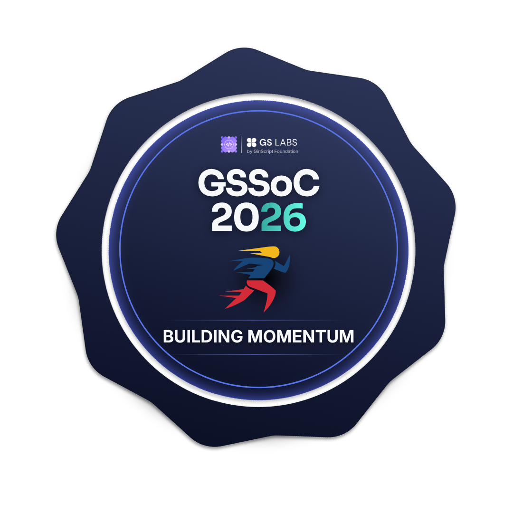
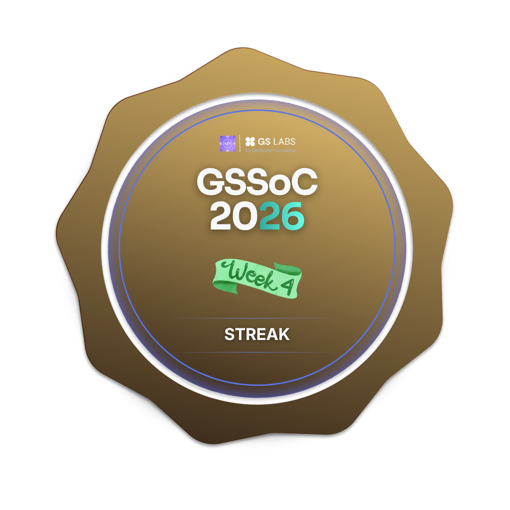
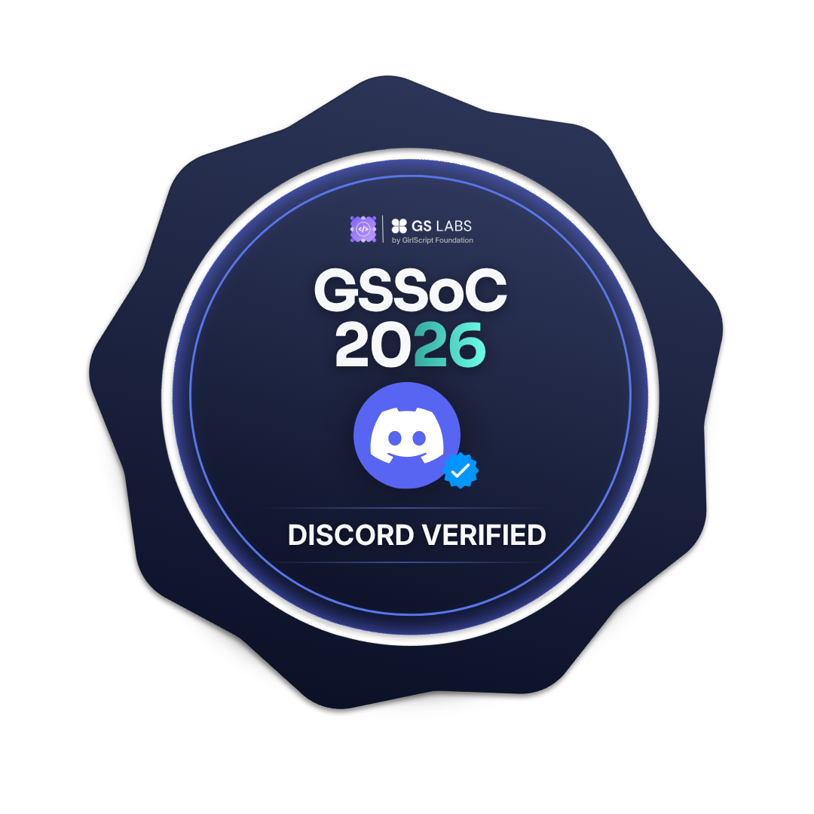

# Rajal Mistry

Hi, I’m Rajal — a full‑stack programmer and software engineer passionate about building scalable systems and integrating AI into real‑world projects. I design production‑ready APIs, craft backend and frontend solutions, and experiment with GenAI to push boundaries. My work is powered by curiosity, clean code, and the occasional caffeine boost — turning complex problems into elegant, efficient solutions.

## Quick Links

---

 <b style="font-size:1.1rem;"> 💻 Tech Stack</b> 

 

| Tech I've Used |
|-----------|
| **⚡⠀Languages** |
|       |
| **🧩⠀Libraries & Frameworks** |
|      |
| **🛠️⠀Tools & Platforms** |
|      |
| **☁️⠀Cloud & DevOps** |
|    |
| **🤖⠀AI / ML & Integrations** |
|     |
| **🔧⠀Other** |
|    |

---

 <b style="font-size:1.2rem;"> 🐙 GitHub Analytics</b> 

 

 

    
|  |  |  |
|:---:|:---:|:---:|
    
|  |  |
|:---:|:---:|

---

# 👩🏻‍💻 Open Source Contributions

## 🏅 My Girl Script Summer Of Code 2026 Badges

  <table style="border-collapse: collapse; border: none;">
    <tr>
      <td align="center" style="padding: 3px;"></td>
      <td align="center" style="padding: 3px;"></td>
      <td align="center" style="padding: 3px;"></td>
      <td align="center" style="padding: 3px;"></td>
      <td align="center" style="padding: 3px;"></td>
      <td align="center" style="padding: 3px;"></td>
    </tr>
    <tr>
      <td align="center" style="padding: 3px;"></td>
      <td align="center" style="padding: 3px;"></td>
      <td align="center" style="padding: 3px;"></td>
      <td align="center" style="padding: 3px;"></td>
      <td align="center" style="padding: 3px;"></td>
      <td align="center" style="padding: 3px;"></td>
    </tr>
    <tr>
      <td align="center" style="padding: 3px;"></td>
      <td align="center" style="padding: 3px;"></td>
      <td align="center" style="padding: 3px;"></td>
      <td align="center" style="padding: 3px;"></td>
      <td align="center" style="padding: 3px;"></td>
      <td align="center" style="padding: 3px;"></td>
    </tr>
  </table>

---

 

Show some ❤️ by starring the repositories you like ⭐ or by buying me a coffee!

 

  

